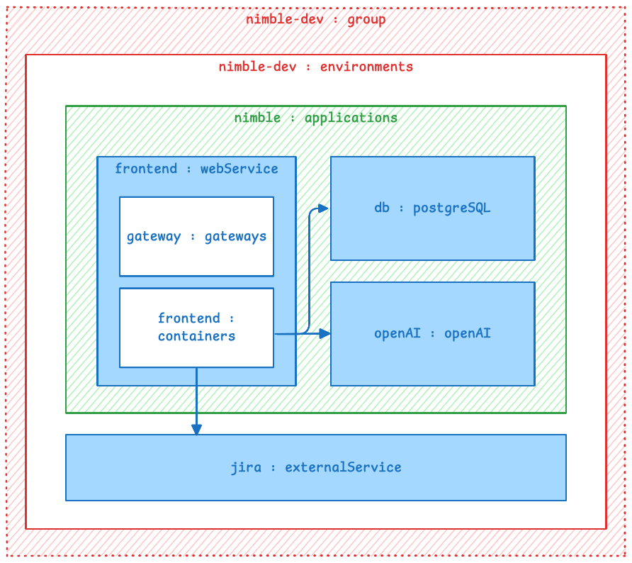

# Nimble Example
This repository is an example Radius setup for an application with four Radius resource types:


In the future, we will implement a `Radius.Resources/openAI` which deploys a model using Azure OpenAI.

## Overview of sample



This sample has the following components:

#### 1. Three resource type definitions defined in YAML in types.yaml: 

* `Radius.Resources/webService` – A resource type which deploys a containerized service. The resource type has a container property based on the Applications.Core/containers resource type. This makes it trivial to pass the container property to the Applications.Core/containers resource in the recipe. The ingress property is used by the developer to specify whether a Applications.Core/gateways should also be created. 

* `Radius.Resources/postgreSQL` – A PostgreSQL database. The only property is setting the database name.

* `Radius.Resources/externalService` – This resource type is used to represent a service which is not mananaged by Radius. Since there is no recipe and no actual resource deployed, it functions similar to a Kubernetes, ConfigMap.

* `Radius.Resources/openAI` – A resource type which deploys Azure OpenAI services. The only property is setting the capacity for the API.

#### 2. A recipe implemented in Bicep for the webServices resource type. 

#### 3. A recipe implemented in Terraform for the postgreSQL resource type.

#### 4. A recipe implemented in Terraform for the openAI resource type.

#### 5. An environment specification which includes the recipes and an externalService resource representing the cloud service Jira.

## Prerequisites

1. Radius CLI at least version 0.46 installed on the workstation
2. Node.js installed on the workstation
3. An AKS cluster
4. A Git repository for storing the Terraform configurations; this tutorial will assumes anonymous access to the Git repository, if that is not the case see [this documentation](https://red-sea-07f97dc1e-1409.westus2.3.azurestaticapps.net/guides/recipes/terraform/howto-private-registry/)

## Setup
### Create resource types

```bash
rad resource-type create webService -f types.yaml
rad resource-type create postgreSQL -f types.yaml
rad resource-type create externalService -f types.yaml
rad resource-type create openAI -f types.yaml
```
Note that resource type names are camelCase and case sensitive.

### Create Bicep extension
```
rad bicep publish-extension -f types.yaml --target radiusResources.tgz
```

### Verify bicepconfig.json
Open bicepconfig.json and verify the `radiusResources` extension is referencing the correct archive file. Bicep extensions in the same working directory can be the filename only. If you move the bicepconfig.json file or the extension archive, you must specify the full file path (not a relative path).

### Publish recipes
This sample demonstrates recipes using both Terraform configurations and Bicep templates. Using Bicep templates for recipes has the advantage of being able to use Radius resource types in the recipe. In this sample, the recipe for the webService resource type uses the containers and gateways resource types. Terraform can only define resources from existing Terraform providers. We do not have a Radius resource provider for Terraform yet so it is not possible to use the containers or gateways resources in Terraform.

When you register a recipe with Radius, you are only creating a pointer to a Terraform configurations or Bicep templates. Terraform configurations are stored in a git repository. Bicep templates are stored in a container registry. In this sample we are ignoring authentication to the Git repository and container registry. If you need to setup authentication see [this for Terraform](https://docs.radapp.io/guides/recipes/terraform/howto-private-registry/) and [this for Bicep](https://docs.radapp.io/guides/recipes/howto-private-bicep-registry/).

**webService**
Publish the webServices Bicep recipe to a container registry:
```
rad bicep publish --file recipes/webservice.bicep \
  --target br:ghcr.io/zachcasper/recipes/webservice:latest
```
`br` stands for Bicep registry. The remainder of the string is a standard container image name.

**postgreSQL**
Push the Terraform configuration to a Git repository. You must use the standard Terraform naming scheme. In this case, the main.tf file is in the postgreSQL directory. 

**openAI**
Push the Terraform configuration to a Git repository. You must use the standard Terraform naming scheme. In this case, the main.tf file is in the openAI directory and requires parameters resource group and location to be passed to the recipe while registering.

### Create environment with recipes registered and Jira externalService resource
Create a resource group for the environment.
```
rad group create nimble-dev
```
Update the env.bicep file with your Azure subscription and resource group (twice). You will need to update this block:
```
providers: {
  azure: {
    // Update subscription and resource group
    scope: '/subscriptions/<subscription-id>/resourceGroups/<resource-group-name>'
  }
}
```
And this block in the openAI recipe:
```
parameters: {
  // Update resource group name
  resource_group_name: 'nimble-dev'
  location: 'eastus'
}
```
Create the nimble-dev environment and the Jira resource in that environment.
```
rad deploy env.bicep --group nimble-dev
```
If you get a `Error: no environment name or ID provided, pass in an environment name or ID`, you may need to create a dummy environment as a workaround for [this bug](https://github.com/radius-project/radius/issues/9453).

Create a workspace.
```
rad workspace create kubernetes nimble-dev \
  --context `kubectl config current-context` \
  --environment nimble-dev \
  --group nimble-dev
```

Confirm the environment was created. You should see this output.
```
$ rad environment list
RESOURCE     TYPE                            GROUP        STATE
nimble-dev   Applications.Core/environments  nimble-dev   Succeeded
```
Confirm the Jira externalService resource was created.
```
$ rad resource list Radius.Resources/externalService
RESOURCE  TYPE                              GROUP        STATE
jira      Radius.Resources/externalService  nimble-dev   Succeeded
```

## Deploy the todolist application
This sample uses the todolist demo application from Radius. Examine the todolist.bicep file and see that there is a reference to the pre-existing Jira resource. Deploy the application.
```
rad deploy todolist.bicep
```
Get the URL for the gateway:
```
rad resource show Applications.Core/gateways gateway -o json | grep url
```
Browse to that URL and examine the environment variables for the PostgreSQL database, Jira, and OpenAI.

Get the application graph.
```
rad app graph -a todolist
```
You should see the resources. This view is under active development so it is likely to change.

## Clean Up

Delete the application.
```
rad application delete -a todolist
```
Delete the environment.
```
rad environment delete nimble-dev
```
Delete the Radius resource group.
```
rad group delete nimble-dev
```
Delete the resource types.
```
rad resource-type delete Radius.Resources/externalService
rad resource-type delete Radius.Resources/openAI
rad resource-type delete Radius.Resources/postgreSQL
rad resource-type delete Radius.Resources/webService